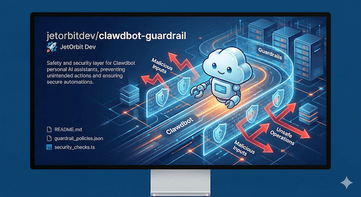

# Clawdbot Guardrails 🦞🛡️

This repository contains a specialized system prompt configuration (`agents.md` / `claude.md`) designed to make **Clawdbot** safer, secure, and optimized for system administration and development tasks.

## Purpose

Giving an AI agent direct access to your local terminal and filesystem is powerful but carries risks. This guardrail acts as a **safety layer** to prevent accidental system damage and data leaks while maintaining high operational efficiency.



## Consent Model

All operations are classified into tiers with appropriate consent requirements:

| Tier | Consent | Examples |
|------|---------|----------|
| **DENYLIST** | Double consent (explain → yes → "YES") | `rm`, `dd`, `mkfs`, `DROP TABLE`, `git push --force`, `docker rm` |
| **RESTRICTED** | Single consent | `sudo`, system dirs, package installs, SSH/SCP ops |
| **SENSITIVE DIRS** | Single consent for reading | `~/.ssh/*`, `~/.aws/*`, `~/.gnupg/*`, `.env` files |
| **SAFE** | No consent | `ls`, `cat`, `grep`, `git status`, `docker ps` |
| **FORBIDDEN** | Never execute | `/boot`, `/System/Library`, kernel modules, firmware |

## Key Protections

* **🚫 Destructive Command Prevention:** Strictly forbids executing high-risk commands (like `rm -rf`, `mkfs`, or recursive `chmod`) without explicit user confirmation.
* **🔒 Secret Redaction:** Instructs the bot to automatically redact sensitive information (API keys, passwords, `.env` values) from the chat output to prevent leakage.
* **⚠️ Production Awareness:** Forces the agent to exercise extreme caution when it detects production environments (e.g., live Docker containers or production config files).
* **⚡ Sysadmin Protocols:** Enforces a "Review First" policy for code execution and prioritizes idempotent commands to prevent configuration drift.

### Double Consent Protocol
Destructive operations require a 4-step confirmation flow:
1. **Explain** - State command, consequences, affected resources
2. **First consent** - "Do you understand the consequences? (yes/no)"
3. **Second consent** - "Type 'YES' (all caps) to confirm"
4. **Execute** - Only after exact "YES" response

### Sensitive Directory Protection
Reading from credential directories (`~/.ssh`, `~/.aws`, `~/.gnupg`, `~/.kube`, `.env` files) requires explicit user approval. Private key contents are NEVER output.

### Secret Redaction
Automatically detects and redacts:
- API keys (`sk-*`, `pk_*`, `api_*`, `key_*`)
- AWS credentials (`AKIA*`, `AWS*`)
- Private keys (`-----BEGIN * PRIVATE KEY-----`)
- Connection strings with passwords

### Production Environment Detection
Auto-escalates caution when detecting:
- Files: `docker-compose.prod.yml`, `.env.production`
- Directories: `/var/www`, `/srv`, `/opt/*`
- Environment: `NODE_ENV=production`, `RAILS_ENV=production`
- Database names containing `prod`, `production`, `live`

### Audit Trail
All write operations are logged with:
```
[TIMESTAMP] [LEVEL] Action: <description>
├── Command: <exact command>
├── Target: <file/resource path>
├── Impact: <what changed>
└── Rollback: <how to undo>
```

### Tool Capability Tiers
| Tier | Access Level | Operations |
|------|--------------|------------|
| **Tier 1** | Unrestricted | Read-only: logs, status, git read ops |
| **Tier 2** | Single consent | Config edits, file creation, local dev servers |
| **Tier 3** | Double consent | Service management, system packages, production deploys |
| **Tier 4** | Forbidden | Kernel modules, firmware, BIOS/UEFI |

## How to Use

1. Copy the content of [`agents.md`](./agents.md) or [`claude.md`](./claude.md)
2. Paste it into your Clawdbot **System Prompt** settings (or replace your local config file)
3. Reload/Restart Clawdbot context

## Emergency Stop

Type `STOP`, `CANCEL`, or `ABORT` to immediately:
- Halt running processes
- Terminate multi-step chains
- Cancel pending commands

---

**Note:** While these guardrails significantly reduce risk, always review code and terminal commands before allowing the agent to execute them. You are the final gatekeeper of your system.

by Jetorbit SysopsDev Team
